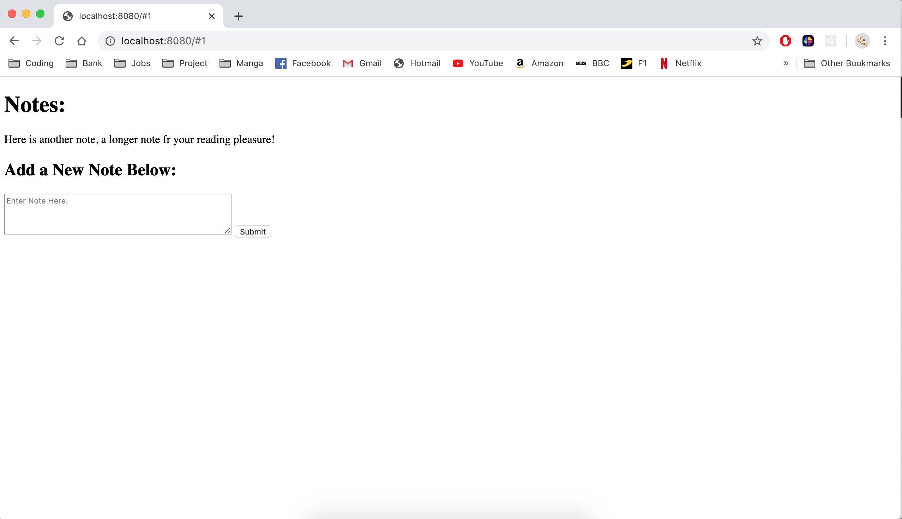

# Note App

This was the Week 7 afternoon challenge from Makers. It involved test driving a single page JavaScript app from scratch - using my own test library (no Jasmine). The idea of TDD was starting to sink in, but now we had to used our own 'assertion' based library bases on the truthy-ness and falsey-ness of a statement.

The app allows a user to enter a note, this will then be added in a clickable link that will have a 20 character display limit. If the link is clicked it will display the whole message. All of this is is done with no page refreshing, and displays a URL change in the browser link for functionality, tell the user the note has changed.

Although the app is basic in styling, it's functionality is great and it demonstrates some complex concepts - a single page JavaScript app using vanilla JavaScript (no jQuery).

---

## How to Run:

Clone this repo, from the command line navigate to the root directory and in the command line check to see if you ahave node.js installed on yout machine by typing:

```
node -v
```

If not, install it by typing in the following command:

```
brew install node
```

Now we want to initialize Node with the Http-Server library. From the root directory, in the command line type:

```
npm install http-server --save
```

You can now run the local server from command line by typing:

```
node node_modules/http-server/bin/http-server
```

Then visit: [_localhost://8080_](http://localhost:8080/)

---

## How to Run Tests

To run the homeade test suite, in the root directory, right click on the [_specRunner.html_](specRunner.html) file and click `Copy Path`. Pase this into the Google Chrome Browser's URL, then open the Chrome Dev Tools (right click, click on `inspect`).

Then navigate to the `console' tab of the Dev tools, you will here 16 tests passing.

---

### Adding a note


---

### Selecting a Note to Read Contents (note hash change when clicked)


